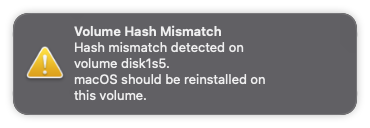

# Actively Used Files

**Table Of Contents**
- [Current NUC BIOS Revision](#current-nuc-bios-revision)
- [Generating Personalised SMBIOS](#generating-personalised-smbios)
- [OpenCore Version Installed](#opencore-version-installed)
- [OpenCore Updates History](#opencore-updates-history)
- [OpenCore Configuration Files](#opencore-configuration-files)
- [Notable Configuration Differences](#notable-differences-in-configurations)
- [OpenCore Main Parameters](#opencore-main-parameters)
- [Sleep/Wake Parameters](#sleepwake-parameters)
- [Volume Hash Mismatch Error](#volume-hash-mismatch-error)
- [Error Installing Delta Update](#error-installing-differential-delta-update)

## Current NUC BIOS Revision

FNCML357.0062.2023.0719.2024

## Generating Personalised SMBIOS

It is important to generate a personalised SMBIOS using `Macmini8,1` as target model. To complete the respective OpenCore configuration section for SMBIOS (namely `MLB`, `SystemSerialNumber` and `SystemUUID` keys) it is advised to use [GenSMBIOS](https://github.com/corpnewt/GenSMBIOS) scripts and add the generated values in the respective places in `config.plist` file.

As for the _unique_ number needed in the **ROM** value of the `PlatformInfo` section, the recommended method is to take the 12 digits from the **en0** network controler (without the colons) and convert them to [Base64](https://cryptii.com/pipes/hex-to-base64) for use as `<data>` under `<key>ROM</key>` in the OpenCore configuration file. The value `<data>ESIzRFVm</data>` is generic; read more over at [Dortania](https://dortania.github.io/OpenCore-Post-Install/universal/iservices.html#fixing-rom).

To confirm that the injected value works persistently across reboots, one can either run in Terminal [iMessageDebug](https://mac.softpedia.com/get/System-Utilities/iMessageDebug.shtml) or the command:<br/>
`nvram -x 4D1EDE05-38C7-4A6A-9CC6-4BCCA8B38C14:ROM` and verify the output.

## OpenCore Version Installed

These files have been running without issues with the official OpenCore releases on [GitHub](https://github.com/acidanthera/OpenCorePkg/releases).

The original configuration, especially setting the "Quirks" to the correct values for this _specific_ NUC chipset and platform, was done by following the [Dortania Guide to OpenCore](https://dortania.github.io/OpenCore-Install-Guide/config.plist/comet-lake.html) and has remained pretty much the same with the last OpenCore iterations.

## OpenCore Updates History

For all configuration changes (either additions or removals) per the respective OpenCore release, consult the configuration [updates](Updates.md) history.

:white_check_mark: Currently running **MacOS 10.14 Sonoma** since OpenCore **1.0.0**.

## OpenCore Configuration Files

* **config.normal.plist** → Boots to default drive as a normal Mac would do (non-verbose) without any boot options displayed; only a small time-window is set to allow options via keyboard; all kexts are enabled, debug logging is disabled. Keys `ShowPicker` set to false, `Timeout` set to 0 seconds and `TakeoffDelay` set 5000 microseconds.

* **config.picker.plist** → Shows boot options (i.e. picker) with basic tools; all hidden Auxiliary tools are displayed if 'Space' is pressed on keyboard; after a brief time-out, continues (non-verbose) booting to default drive; all kexts are enabled, debug logging is disabled. Keys `ShowPicker` set to true, `Timeout` set to 5 seconds and `TakeoffDelay` set 0 microseconds.

* **config.emergency.plist** → Shows boot options (i.e. picker) with **all** Auxiliary tools displayed; after a brief time-out, continues **verbose** `-v` booting to default drive; Wi-Fi and BTLE kexts are disabled; debug logging is enabled, including boot arguments being present. Keys `HideAuxiliary` set to false, `ShowPicker` set to true, `Timeout` set to 5 seconds. Additionally, `SecureBootModel` is disabled, `PanicNoKextDump`, `AppleDebug`, `ApplePanic`, `AllowNvramReset`, `AllowSetDefault` and `AllowToggleSip` are now enabled. Special boot arguments `keepsyms=1`, `debug=0x100`, `npci=0x2000` and `msgbuf=1048576` are set. **This file is notably used for macOS USB installers.**

All configuration files have been **validated** with `ocvalidate` tool that has been included in the OpenCore releases since version 0.6.5.

## Notable Differences in Configurations

According to the [OpenCore documentation available](https://github.com/acidanthera/OpenCorePkg/blob/master/Docs/Configuration.pdf), these are the main points that change between these configurations above.

**Kernel → Quirks → PanicNoKextDump**

When enabled, macOS kernel is prevented from printing kext dumps in the panic log, thus helping observe the panic details themselves (only applicable to macOS 10.13 and newer).

**Misc → Boot → TakeoffDelay**

Delay (in microseconds) executed _before_ handling the OpenCore picker startup and action hotkeys. Introducing a delay may give extra time to hold the right action hotkey sequence to, for instance, boot into recovery mode. On some platforms, setting this option to a minimum of 5000-10000 microseconds may be required to access action hotkeys due to the nature of the keyboard driver.

**Misc → Boot → Timeout**

Timeout (in seconds) in the OpenCore picker _before_ automatic booting of the default boot entry starts; set to 0 to disable.

**Misc → Debug → AppleDebug**

Enables writing the `boot.efi` debug log to the OpenCore log (only applicable to macOS 10.15.4 and newer).

**Misc → Debug → ApplePanic**

Saves macOS kernel panic output to the OpenCore root (EFI) partition. The file is saved as `panic-YYYY-MM-DD-HHMMSS.txt` and it is strongly recommended to include the `keepsyms=1` boot argument that allows printing debug symbols in the panic log.

**Misc → Debug → DisplayLevel**

The following debug output levels are supported, provided that `Target` enables console (on-screen) printing:

* `0x00000002 - DEBUG_WARN in DEBUG, NOOPT, RELEASE`
* `0x00000040 - DEBUG_INFO in DEBUG, NOOPT`
* `0x00400000 - DEBUG_VERBOSE` in custom builds
* `0x80000000 - DEBUG_ERROR in DEBUG, NOOPT, RELEASE`

The most common value found in many configurations is `<integer>2147483648</integer>` that translates to `0x80000000` as well as `<integer>2147483650</integer>` that translates to `0x80000002`.

**Misc → Debug → Target**

The following logging targets are supported, besides `0x00` that is the failsafe value:

* `0x01` Enable logging, otherwise all log is discarded
* `0x02` Enable basic console (on-screen) logging
* `0x04` Enable logging to Data Hub
* `0x08` Enable serial port logging
* `0x10` Enable UEFI variable logging
* `0x20` Enable non-volatile UEFI variable logging
* `0x40` Enable logging to file

**Misc → Security → AllowNvramReset**

This option allows `CMD+OPT+P+R` keyboard shortcut during boot, while _also_ activating the display of the "NVRAM Reset" entry in OpenCore picker.

**Misc → Security → AllowSetDefault**

Allows using `CTRL+Enter` and `CTRL+Index` keyboard shortcuts that can change the default boot option (drive) in the OpenCore picker.

**Misc → Security → AllowToggleSip**

Enables in OpenCore picker the entry for disabling and enabling System Integrity Protection (SIP). **Note:** It is strongly recommended to _not_ make a habit of booting macOS with SIP disabled. The existence of this boot option is to just make it _easier_ to quickly disable SIP protection when genuinely needed, but it should be re-enabled again afterwards.

**Misc → Security → ScanPolicy**

The assigned value allows or prevents OpenCore from scanning and booting from untrusted sources (and partitions). A typical value of `17760515` (integer) or `0x10F0103` (hexadecimal) allows booting from most expected modern sources, whereas a value of `0` (zero) _disables_ this feature and allows booting from **any** source, especially useful for **USB installers.**

* `0x00000001 - OC_SCAN_FILE_SYSTEM_LOCK` restricts scanning to **file systems** defined as a part of this policy
* `0x00000002 - OC_SCAN_DEVICE_LOCK` restricts scanning to **device types** defined as a part of this policy
* `0x00000100 - OC_SCAN_ALLOW_FS_APFS` allows scanning of APFS file system
* `0x00010000 - OC_SCAN_ALLOW_DEVICE_SATA` allow scanning SATA devices
* `0x00020000 - OC_SCAN_ALLOW_DEVICE_SASEX` allow scanning SAS and Mac NVMe devices
* `0x00040000 - OC_SCAN_ALLOW_DEVICE_SCSI` allow scanning SCSI devices
* `0x00080000 - OC_SCAN_ALLOW_DEVICE_NVME` allow scanning NVMe devices
* `0x01000000 - OC_SCAN_ALLOW_DEVICE_PCI` allow scanning devices directly connected to PCI bus

**Misc → Security → SecureBootModel**

Sets Apple Secure Boot hardware model and policy. Specifying this value defines which operating systems will be bootable. Operating systems shipped before the specified model was released, will not boot. A value `Default` will match the model from the SMBIOS defined in the configuration; a value `Disabled` will match no model and Secure Boot will be disabled.

**UEFI → APFS → MinDate**

The APFS driver _date_ connects the APFS driver with the respective _calendar_ release date of macOS. This option allows restricting APFS drivers to modern macOS versions. A default date value of `0` (zero) corresponds to 2021/01/01 and can be used for macOS Big Sur and newer; a value of `-1` permits any macOS release to load, as it actually _disables_ this feature.

**UEFI → APFS → MinVersion**

The APFS driver _version_ connects the APFS driver with the respective macOS _release_. This option allows restricting APFS drivers to modern macOS versions. A default version value of `0` (zero) can be used for macOS Big Sur and newer; a value of `-1` permits any macOS version to load, as it actually _disables_ this feature.

## OpenCore Main Parameters

1. The following **important** DSDT patches are enabled:

Rename `_STA` to `XSTA` for device `(H_EC)` allowing to disable this native device and use **SSDT-EC-USBX.aml** that injects a fake `(EC)` device that is absolutely required for a successful boot into macOS.

2. The following **important** CPU ID faking must be used:
```
	<key>Cpuid1Data</key>
	<data>7AYIAAAAAAAAAAAAAAAAAA==</data>
	<key>Cpuid1Mask</key>
	<data>/////wAAAAAAAAAAAAAAAA==</data>
```
Without this "Emulate" parameter in "Kernel" section, the NUC will _not_ boot into Catalina or Big Sur, due to the fact that this NUC Core i7 CPU seems unsupported.

The above `<data>` value is translated as `0xec060800000000000000000000000000` in hexadecimal. In reverse-bytes it is referencing `0x0806EC` that apparently belongs to the Comet Lake processor family with ID **0806ECh** that includes [Intel Core i5-10210U](https://www.cpu-world.com/CPUs/Core_i5/Intel-Core%20i5%20i5-10210U.html) which is supported by macOS, at this time.

There have also been earlier OpenCore configurations for this NUC that have been using `<data>6wYIAAAAAAAAAAAAAAAAAA==</data>` that translates to `0xeb060800000000000000000000000000` in hexadecimal. This value is referencing `0x0806EB` that seems to belong to the previous CPU family of Whiskey Lake processors with ID **0806EBh** that includes [Intel Core i5-8265U](https://www.cpu-world.com/CPUs/Core_i5/Intel-Core%20i5%20i5-8265U.html) which is also supported by macOS, at this time.

3. The following basic IGPU embedded graphics IDs are injected:
```
	<key>AAPL,ig-platform-id</key>
	<data>BwCbPg==</data>
	<key>device-id</key>
	<data>mz4AAA==</data>
```
This NUC is embedding the Intel UHD Graphics 630 (Mobile) display controller with PCI ID of [[8086:3e9b]](http://pci-ids.ucw.cz/read/PC/8086/3e9b) that seems to be the one used by `Macmini8,1` natively. However, if no IDs are injected or the wrong ones, **WhateverGreen** may be assigning a different set of IDs (probably due to the CPU platform) which has insofrar led many times to lack of acceleration or computer freezes.

It is thus important to _force_ a `device-id` and an `ig-platform-id` value in OpenCore that reflect this Mac Mini IGPU hardware, thus matching this NUC hardware. This leads to the safe use of `device-id` value `0x3e9b0000` and `AAPL,ig-platform-id` as `0x3e9b0007` (byte-swapped) thanks to Hackintool. See **DeviceProperties** at [Dortania](https://dortania.github.io/OpenCore-Install-Guide/config-laptop.plist/coffee-lake-plus.html#deviceproperties).

:warning: Starting from OpenCore 0.7.8 configuration, a more precise port definition was added in order to correctly identify the embedded HDMI port. For more information, consult the configuration [updates](Updates.md) history.

4. The following custom SSDTs are included, defined and enabled:

* SSDT-APPLE.aml
* SSDT-AWAC.aml
* SSDT-DTGP.aml
* SSDT-EC-USBX.aml
* SSDT-HPTE.aml
* SSDT-NAMES.aml
* SSDT-PLUG.aml
* SSDT-PMCR.aml
* SSDT-SBUS.aml
* SSDT-TITAN.aml
* SSDT-XOSI.aml → disabled

The ACPI code and justification for each custom SSDT is described in more detail in the [SSDTs](../SSDTs) section.

5. The following kexts are included, defined and required:

* [AirportItlwm.kext](https://github.com/OpenIntelWireless/itlwm/releases)
* [AppleALC.kext](https://github.com/acidanthera/AppleALC/releases)
* [IntelBluetoothFirmware.kext](https://github.com/OpenIntelWireless/IntelBluetoothFirmware/releases)
* [IntelBluetoothInjector.kext](https://github.com/OpenIntelWireless/IntelBluetoothFirmware/releases) → removed :warning:
* [IntelBTPatcher.kext](https://github.com/OpenIntelWireless/IntelBluetoothFirmware/releases)
* [BlueToolFixup.kext](https://github.com/acidanthera/BrcmPatchRAM/releases)
* [IntelMausi.kext](https://github.com/acidanthera/IntelMausi/releases)
* [Lilu.kext](https://github.com/acidanthera/Lilu/releases)
* [NVMeFix.kext](https://github.com/acidanthera/NVMeFix/releases) → disabled
* [RestrictEvents.kext](https://github.com/acidanthera/RestrictEvents/releases)
* [SMCProcessor.kext](https://github.com/acidanthera/VirtualSMC/releases)
* [SMCSuperIO.kext](https://github.com/acidanthera/VirtualSMC/releases)
* [VirtualSMC.kext](https://github.com/acidanthera/VirtualSMC/releases)
* [WhateverGreen.kext](https://github.com/acidanthera/WhateverGreen/releases)
* USBPorts.kext

:warning: Starting from OpenCore 0.7.9 configuration, this NUC will be running **macOS Monterey** and a major change in the loaded kexts has taken place, namely the replacement of `IntelBluetoothInjector.kext` with `BlueToolFixup.kext` so please be aware.

**Note:** It has not been validated if the use of **NVMeFix.kext** improves overall sleep or power consumption, therefore this kext is at this moment just disabled and won't get loaded.

## Sleep/Wake Parameters

The following parameters can be set via Terminal, according to the Dortania guide to [Fixing Sleep](https://dortania.github.io/OpenCore-Post-Install/universal/sleep.html#preparations):

```
sudo pmset autopoweroff 0; \
sudo pmset powernap 0; \
sudo pmset standby 0; \
sudo pmset proximitywake 0; \
sudo pmset tcpkeepalive 0
```

These `pmset` parameters above achieve the following:

* Disable `Auto Power-Off` → prevents this form of hibernation;
* Disable `Power Nap` → prevents periodically waking the computer for network and updates(but not the display);
* Disable `Standby` → minimises the time period between sleep and going into hibernation;
* Disable `Proximity Wake` → does not allow waking from an iPhone or an Apple Watch when they come near;
* Disable `TCP Keep Alive` → prevents the mechanism that wakes the computer up every 2 hours.

## Volume Hash Mismatch Error

This new error started to recently appear after the update to **Montery OS** and late OpenCore 0.8.x series.



On real Macs it seems that this "hash" error would show up if _something_ corrupted the so-called "Sealed System Volume" which is a technology used in Big Sur and newer; it ensures no OS modifications are being done in the system volume but _only_ in the data volume.

However, as this is not the case on this NUC, per numerous reports found on-line, many people have linked the appearance of this error with the use of the Bluetooth module or some weird combination of a specific range of NVMe controllers.

The following check-list is based on the various messages posted on [Reddit](https://www.reddit.com/r/hackintosh/search/?q=Volume%20Hash%20Mismatch) and [InsanelyMac](https://www.insanelymac.com/forum/topic/350102-volume-hash-mismatch-hash-mismatch-detected-on-volume-disk1s5/) in order to exclude affecting factors and perhaps narrow down the root cause:

* `NVMeFix.kext` is _not_ loaded or used :white_check_mark:
* `FeatureUnlock.kext` is _not_ loaded or used :white_check_mark:
* Using an Intel Wi-Fi/BTLE combo (embedded) module :white_check_mark:
* Using a crafted `USBPorts.kext` with mapped USB ports :white_check_mark:
* Samsung NVMe disks _not_ installed or used as primary OS drive :white_check_mark:
* OpenCore setting `UEFI` → `ProtocolOverrides` → `HashServices` set to TRUE as expected (CPU is newer to Haswell) :white_check_mark:

Insofar, no definitive solution has been proposed or validated.

## Error Installing Differential (Delta) Update

With recent OS versions, there seems to be an issue when selecting the _differential_ macOS update i.e. "Delta" that is usually smaller in size, compared to the full installer that counts many Gigabytes. Updating macOS via System Settings (i.e. System Preferences) may produce an **error** after downloading the package and during "preparation".

According to user **Winthryth** in this [Reddit post](https://www.reddit.com/r/hackintosh/comments/10km392/ventura_incremental_update_smaller_update_always/) the fault lies in the fact that some active kexts seemingly use Lilu to dynamically patch macOS binaries during boot (expected) but that breaks the Delta update during validation.

For macOS **Monterey** and **Ventura** the kexts found to block these updates are `BlueToolFixup.kext` and `RestrictEvents.kext` so disabling these in the OpenCore configuration _temporarily_, allows the Delta macOS update to succeed. They can be re-enabled later without issues.

For macOS **Sonoma** however, there is a need to keep `RestrictEvents.kext` enabled in the OpenCore configuration and also add the argument `revpatch=sbvmm` in the configuration's `boot-args` (NVRAM section) for this Mac model to correctly detect OS updates.

If either solution fails, then downloading and installing the full macOS Installer for that new build will always work, but will take a little longer (and more space). Do not forget to backup.
More on installers [here](https://www.macworld.com/article/671911/how-to-get-old-macos-download-big-sur-catalina-mojave-and-more.html).
