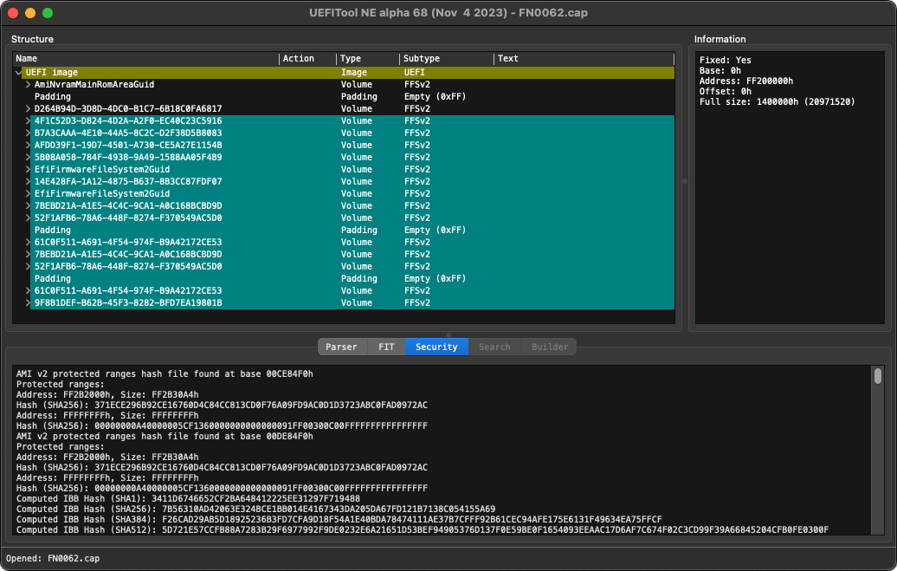
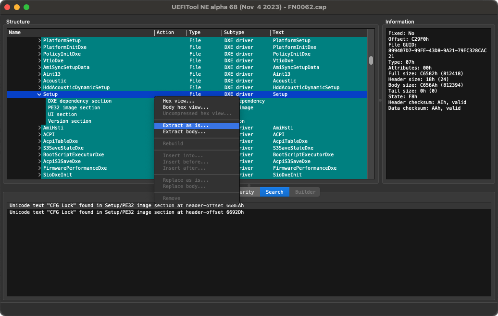

# CFG Lock Detection & Management

## Introduction

According to the [Dortania Guide](https://dortania.github.io/OpenCore-Post-Install/misc/msr-lock.html#what-is-cfg-lock), **CFG Lock** or otherwise known as the "MSR 0xE2" register, is a setting in BIOS that allows for this specific MSR (Model Specific Register) register to be written to. By default, most motherboards **lock** this variable (i.e. read, not write) with many even _hiding_ the option from the BIOS user interface. The reason we care about it, is that macOS actually wants to **write** to this register, and not just one part of macOS: both the Kernel (XNU) and `AppleIntelPowerManagement` want to access it, as it used for the CPU's power management, essential for macOS. Without the ability to write to MSR 0xE2, all or most of the CPU power management is lost and the system may not even boot (unless the correct Quirk is enabled).

Some time ago, this NUC had the "MSR 0xE2" register easily unlocked via a simple, nice UEFI tool by InsanelyMac user **Brumbaer** called [CFGLock.efi](https://www.insanelymac.com/forum/topic/344035-cfglock-unlock-msr-0xe2/) that was run on the UEFI Shell. However, the tool was not further developped and OpenCore developers later introduced their own tool called `ControlMsrE2.efi` that is now part of the OpenCore releases.

Recent versions of the NUC BIOS by Intel somehow _broke_ the ability to change the value of CFG Lock and thus allow access to the MSR register, both with the original **CFGLock.efi** tool as well as the later **ControlMsrE2.efi** tool, as they reported errors when attempting. This means that my last hope to find a solution **before considering the fact that Intel locked this variable in the BIOS for good,** was to perform the steps described below.

**N.B.** Adequate knowledge and skills using **Terminal.app** are required. Please know that the purpose of this guide is to document the steps needed, not teach how to use the tools.

## Required Tools

* Download [UEFITool](https://github.com/LongSoft/UEFITool/releases/) for Mac, e.g. `UEFITool_NE_A68_universal_mac.zip`
* Download [Universal IFR Extractor](https://github.com/LongSoft/Universal-IFR-Extractor/releases/) for Mac, e.g. `ifrextract_v0.3.7.mac.zip`
* Download [setup_var](https://github.com/datasone/setup_var.efi/releases/) UEFI tool, e.g. latest `setup_var.efi`
* Download latest Intel NUC BIOS zip (see in [BIOS](../BIOS/) folder)

**N.B.** The latest build of `ifextract` is v0.3.7 released on December 15, 2020 which works on Apple Intel (x64) systems but it has been discontinued by the developer. This tool is command-line only (CLI).

## First steps

Once the needed tools are downloaded, install `UEFITool.app` to your local Applications folder and have the `ifrextract` binary copied in the `/usr/local/bin/` directory, for example. Unzip the contents of the BIOS version the NUC has been flashed with e.g. `FN0062 BIOS Update.zip` and obtain the actual BIOS file named `FN0062.cap`.

## Examine NUC firmware via UEFITool

Launch **UEFITool** and open your BIOS image file, for example `FN0062.cap`. You will be presented with a screen like this:



Next, press Cmd+F and search for the Unicode text `CFG Lock` in the respective dialog box. If no results appear, it could mean that the firmware no longer supports the `CFG Lock` feature.


In the "Search" results section at the bottom, there should be at least one entry (line) so double-click on the first available result. You will be taken to the respective firmware section that contains our searched text:



Click on the parent container, in our case it wil be `Setup`. Now, right-click over it to select the menu option "Extract as is..." and select a destination folder of your choice, where we will be working next. The automatically generated file name would be `File_DXE_driver_Setup.ffs` but you can simply save it as `Setup.bin` for example.

## Converting the extracted structure

Open a **Terminal.app** session and go to the directory where you saved `Setup.bin` for example, and convert this structure file to human-readable plain text:

```
% /usr/local/bin/ifrextract Setup.bin Setup.txt

Input: Setup.bin
Output: Setup.txt
Protocol: UEFI
```

Now, with some text editor or viewer (e.g. BBEdit) open the resulting `Setup.txt` and search for the term `CFG Lock` again. The result should be something like this:

```
0x32C5A	Form: View/Configure CPU Lock Options, FormId: 0x274A {01 86 4A 27 D8 01}
0x32C60		One Of: CFG Lock, VarStoreInfo (VarOffset/VarName): 0x3E, VarStore: 0x11, QuestionId: 0x244, Size: 1, Min: 0x0, Max 0x1, Step: 0x0 {05 91 BC 03 BD 03 44 02 11 00 3E 00 10 10 00 01 00}
0x32C71			One Of Option: Disabled, Value (8 bit): 0x0 {09 07 04 00 00 00 00}
0x32C78			One Of Option: Enabled, Value (8 bit): 0x1 (default) {09 07 03 00 30 00 01}
0x32C7F		End One Of {29 02}
0x32C81		One Of: Overclocking Lock, VarStoreInfo (VarOffset/VarName): 0xDA, VarStore: 0x11, QuestionId: 0x245, Size: 1, Min: 0x0, Max 0x1, Step: 0x0 {05 91 B8 03 B9 03 45 02 11 00 DA 00 10 10 00 01 00}
0x32C92			One Of Option: Disabled, Value (8 bit): 0x0 {09 07 04 00 00 00 00}
0x32C99			One Of Option: Enabled, Value (8 bit): 0x1 (default) {09 07 03 00 30 00 01}
0x32CA0		End One Of {29 02}
0x32CA2	End Form {29 02}
```

Normally, you would find only one occurrence of `CFG Lock` entry in this text file.

Now, study carefully the line:

`CFG Lock, VarStoreInfo (VarOffset/VarName): 0x3E, VarStore: 0x11, QuestionId: 0x244, Size: 1 [...]`

This tells us that the `CFG Lock` variable is found/stored in `VarStore: 0x11` at the `VarOffset: 0x3E` and has size of `0x01` byte. Now, we move all the way up of the `Setup.txt` file, where there normally is a reference list of all available VarStore folders in the firmware. We search for `0x11` and we should find:

`0x2A235  VarStore: VarStoreId: 0x11 [B08F97FF-E6E8-4193-A997-5E9E9B0ADB32], Size: 0x23D, Name: CpuSetup {24 1F [...]`

Here we read that the name of `VarStore: 0x11` is called `CpuSetup`.

Therefore, our CFG Lock variable is found in `VarStore: 0x11` named `CpuSetup` at `VarOffset: 0x3E` with size of `0x01` byte.

:warning: Variable offsets are unique not just to each motherboard but **even to its firmware version.** Never try to use an offset without checking!

## Booting in UEFI to change the value

We will now need to mount our EFI partition and copy the UEFI tool `setup_var.efi` in our **Tools** folder of our bootloader e.g. in `/EFI/OC/Tools/` and after ejecting the EFI partition, we reboot the computer. On the OpenCore Picker screen, we choose the *UEFI Shell* icon (meaning **OpenShell.efi** must be registered and enabled in your `config.plist`).

In the shell screen, we should find our boot EFI partition by entering the drive such as `FS0:`, `FS1:` or even `FS2:` depending on the system setup and boot disk partition(s) of the NUC. A good practice is to type the drive name and then `dir` the contents, to be sure we are in the correct EFI partition.

Once we change to the Tools directory via `cd`, we can find our `setup_var.efi` tool and we can now attempt to disable the **CFG Lock** feature by setting a value of `0x00` i.e. zero. If we check the help text of the `setup_var.efi` tool via `-h` or `--help` we will see the syntax needed:

```
Usage: setup_var.efi <OFFSET> [<VALUE>] [-s <VALUE_SIZE>] [-n <VAR_NAME>] [-i <VAR_ID>] [-r/--reboot] [--write_on_demand]

OFFSET: The offset of value to be altered in the UEFI variable.
	VALUE: The new value to write, capped at 64-bit. If not specified, the value at OFFSET will be read and shown.
	VALUE_SIZE: Bytes of value to write, must be equal or larger than the size of <VALUE>, defaults to 0x1.
	VAR_NAME: The name of UEFI variable to be altered, defaults to "Setup".
	VAR_ID: Unique id for distinguishing variables with same name, which will be provided by setup_var.efi (when required).
	-r or --reboot: Reboot (warm reset) the computer after the program successfully finishes.
	--write_on_demand: If the value desired to be written is the same with storage, skip the unnecessary write.

	OFFSET, VALUE, VALUE_SIZE and VAR_ID are numbers, and must be specified in hexadecimal with prefix "0x".

	The program defaults to little endian for values ONLY while operating UEFI variables,
	though it's recommended to only operate on one byte if you are not sure what this is or means.
```

Our resulting command to enter in the UEFI Shell and with the information extracted from the previous section and effort, is therefore:

`.\setup_var.efi 0x3E 0x00 -s 0x01 -n CpuSetup -r`

## Outcome

It looks like on the Intel NUC with firmware 0062 this **cannot** be achieved. When entered the command, an error appeared **"WRITE_PROTECTED"** as an output, which confirmed my suspictions: **Intel has locked this value and we can no longer update it by any means.** Reverting to a previous firmware version may not be easy or possible, as Intel mention this clearly in their Release Notes.

## Conclusion

Unfortunately, proper CPU power management can no longer be achieved with a locked MSR 0xE2 register, and in order to bypass this blocker and be allowed to boot, the Kernel Quirk `AppleXcpmCfgLock` in OpenCore configuration was set to TRUE (due to the CPU generation, see the OpenCore [Configuration PDF](https://github.com/acidanthera/OpenCorePkg/blob/master/Docs/Configuration.pdf) for more information).

## Alternatives

There is an alternative tool called [RU](https://github.com/JamesAmiTw/ru-uefi/) alongside a nice guide created by user [Dreamwhite](https://github.com/dreamwhite/bios-extraction-guide/blob/master/ru.efi.md) which offers a visual interface when navigating in the local saved BIOS sections and parameters, with the ability to change them on-the-fly, but I will _not_ attempt anything further as it will likely **not** work either, because the NVRAM parameters for the **CFG Lock** seem read-only regardless of the tool used. Thank you, Intel...
