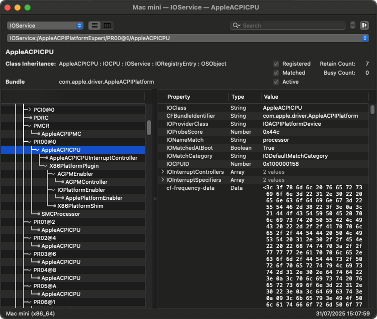
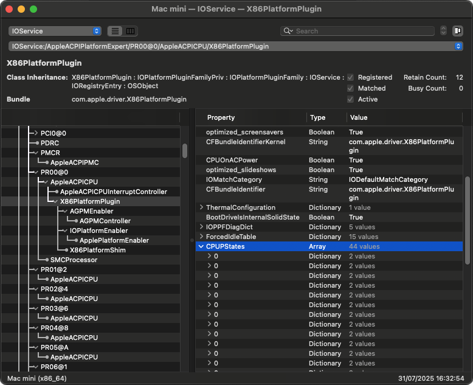
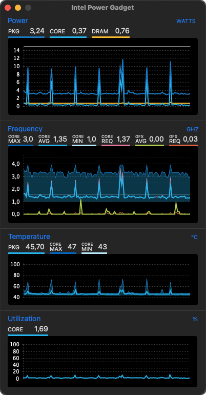

# Improving CPU Power Management

## Generating the Correct CPU Profile

By default, the `Macmini8,1` SMBIOS that we currently use does _not_ fully use HWP (Speed Shift) data as dynamically as newer Mac laptop SMBIOSes do, for example.

Moreover, if we do _not_ define a correct CPU profile, macOS will just load and use the embedded, native profile that corresponds to our active SMBIOS, thus imposing a power management behaviour that will differ between e.g. `Macmini8,1`, `MacBookAir8,1` or even `MacBookPro15,2` models, despite using the same CPU in our hackintosh setup.

For our NUC's Intel i7-10710U (Comet Lake-U) mobile processor, we find that the closest match is a `MacBookPro16,2` computer (that uses Intel i7-1068NG7 with 6 cores / 12 threads and 28W TDP). However, it was found by other users that the profile of `MacBookPro15,2` offers better compatibility and smoother performance curves versus more frequent CPU spikes, at use.

In order to achieve an optimal CPU experience and keep temperatures low when idle, we need to have installed **Intel Power Gadget** and temporarily download and have ready-to-run the [CPUFriendFriend](https://github.com/corpnewt/CPUFriendFriend) tool in Terminal.app. These are the steps taken to generate the CPU profile shared here:

* Mount EFI partition and make a copy of the active `config.plist`
* Inside this file, change SMBIOS to `MacBookPro15,2`
* Optionally, change `SystemSerialNumber` and `MLB` keys with generated values from `macserial` tool
* If already connected to iCloud and if all services work well, temporarily disable `IntelMausi` and `AirportItlwm` kexts to prevent them from loading and thus _not_ connect to Apple servers at all, during this exercise
* Reboot the computer, preferrably clearing NVRAM via the OpenCore picker menu (if available)
* Once landing on the Desktop, launch Terminal.app and start the `CPUFriendFriend.command` in the folder where it's installed

This nice tool will detect the SMBIOS set as `MacBookPro15,2` and will copy the native profile of this specific SMBIOS, whilst performing some further tweaks, namely:

* **Low Frequency Mode (LFM):** We set our CPU's lowest value of 1100MHz per its speficitations = `0x0B`
* **Energy Performance Preference (EPP):** Let's choose a balanced value such as a Modern MacBook Air = `0x80`
* **Performance Bias Range:** Let's keep the value found in Modern MacBook Pro & Mac Mini = `0x05`
* **Additional Energy Savings Options:** By all means, we do want these to be enabled as well

The result of this exercise will be a folder named `CPUFriendDataProvider.kext` with the new CPU profile inside `Info.plist`.

## Add CPU Profile to OpenCore Configuration

* Mount EFI partition and revert to the copy of `config.plist` previously used
* Normally, this configuration now has the SMBIOS set back to `Macmini8,1` including any S/N and MLB keys
* We open the configuration and need to include in Kernel → Add → section two new kexts: [CPUFriend](https://github.com/acidanthera/CPUFriend/releases) and the above-generated `CPUFriendDataProvider.kext` that we copy in the OpenCore `/Kexts/` folder, respectively i.e. together with all other kexts used
* First need to load the main `CPUFriend.kext` and _then_ the introduced profile :warning:
* Respect the kext-loading order with **Lilu** being always first :warning:
* The new section being added, somewhere under **Lilu** and **VirtualSMC** and **WhateverGreen** would look like:

```
	<dict>
		<key>Arch</key>
		<string>Any</string>
		<key>BundlePath</key>
		<string>CPUFriend.kext</string>
		<key>Comment</key>
		<string></string>
		<key>Enabled</key>
		<true/>
		<key>ExecutablePath</key>
		<string>Contents/MacOS/CPUFriend</string>
		<key>MaxKernel</key>
		<string></string>
		<key>MinKernel</key>
		<string></string>
		<key>PlistPath</key>
		<string>Contents/Info.plist</string>
	</dict>
	<dict>
		<key>Arch</key>
		<string>Any</string>
		<key>BundlePath</key>
		<string>CPUFriendDataProvider.kext</string>
		<key>Comment</key>
		<string></string>
		<key>Enabled</key>
		<true/>
		<key>ExecutablePath</key>
		<string></string>
		<key>MaxKernel</key>
		<string></string>
		<key>MinKernel</key>
		<string></string>
		<key>PlistPath</key>
		<string>Contents/Info.plist</string>
	</dict>
```

* Save the configuration, close it, test it with `ocvalidate` and we are good to go.
* Unmount the EFI partition, reboot the computer.

## Confirming CPU Profile is in Use

Upon landing on the Desktop again, we launch **Intel Power Gadget** and allow macOS to go idle, while keeping track of the curves. We could also launch **IORegistryExplorer.app** as well, and confirm the profile is loaded under **Root → AppleACPIPlatformExpert → PR00 → AppleACPICPU → cf-frequency-data** where the latter is the actual profile being taken into consideration. In the same tree for the first processor, we will also see `X86PlatformPlugin` being loaded and present, despite the absence of the `SSDT-PLUG.aml` injection, together with an entry for the `CPUPStates` that are used.





Alternatively, we can use the CLI to obtain (and dump a small portion of) the needed confirmation:

```
% kextstat | grep -i cpufriend
0xffffff8003fa2000   0xb000   0xb000   org.acidanthera.driver.CPUFriend (1.3.0) [...]

% ioreg -lw0 -c AppleACPICPU | awk '/PR00/,/cf-frequency-data/' | grep "cf-frequency-data" | cut -c -64
    | | | |   "cf-frequency-data" = <3c3f786d6c2076657273696f6e3[...]

% ioreg -lw0 -c AppleACPICPU | grep -c "cf-frequency-data"
12

% pmset -g therm
Note: No thermal warning level has been recorded
Note: No performance warning level has been recorded
   CPU_Scheduler_Limit = 100
   CPU_Available_CPUs = 12
   CPU_Speed_Limit = 100

% ioreg -lw0 -c X86PlatformPlugin | awk '/optimized/' | grep -vi IOPlatformPowerProfile
    | | | |   "optimized_photobooth" = Yes
    | | | |   "optimized_visualizers" = Yes
    | | | |   "optimized_screensavers" = Yes
    | | | |   "optimized_slideshows" = Yes

% sysctl -a | grep machdep.xcpm
```

The first command checks that our `CPUFriend.kext` is loaded; the second command outputs parts of
`cf-frequency-data` meaning our custom CPU profile is correctly injected in our system; the third command counts how many CPUs contain `cf-frequency-data` and in our case, it should be all 12 threads of our Intel i7-10710U processor.

Furthermore, the fourth command shows that our system is _not_ suffering from any sort of throttling whilst providing full CPU performance, while the fifth command confirms that what CPUFriendFriend asked us to enable at the end of the procedure, has been included. Further details are being presented with the last command, where we should see some of the following values:

* `xcpm.mode: 1` denotes that XCPM i.e. native Apple power management is active
* `max_100mhz_ratio: 47` is our maximum CPU multiplier i.e. 47 × 100 MHz = 4.7 GHz i.e. our CPU turbo frequency
* `min_100mhz_ratio: 4` is our minimum CPU multiplier i.e. 400MHz and although not being 1100MHz of our CPU specifications, this is not too important as XCPM uses logical ratios (and not tied 1:1 with Intel P-states) representing the _lowest logical ratio_ that XNU scheduler can use; XCPM reports what macOS _allows_ but at the end, Intel microcode and firmware determine what is actually _executed_
* `xcpm.lpm_enabled: 0` means Low Power Mode is disabled which is normal, as we don't have a real Mac with T2 chip
* `xcpm.vectors_loaded_count: 1` confirms that a CPU power profile is loaded once (via CPUFriend)

Read the respective [Dortania guide](https://dortania.github.io/OpenCore-Post-Install/universal/pm.html#using-cpufriend) for more information.

A typical readout of the Intel NUC in idle state, using the new CPU profile, once all boot activities of macOS Sonoma 14.7.6 end:


