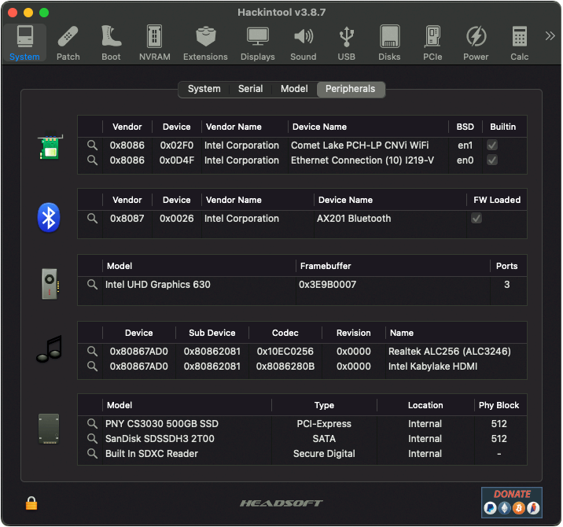
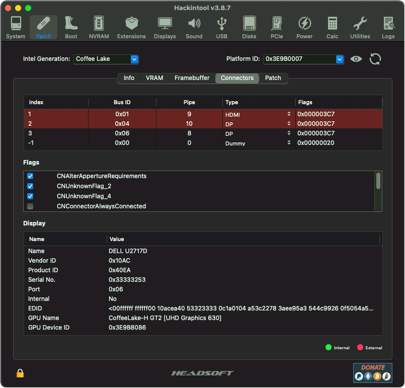
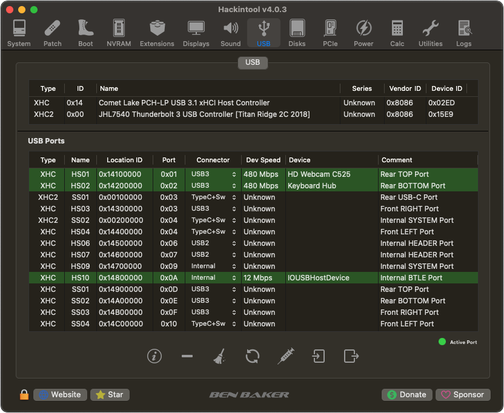
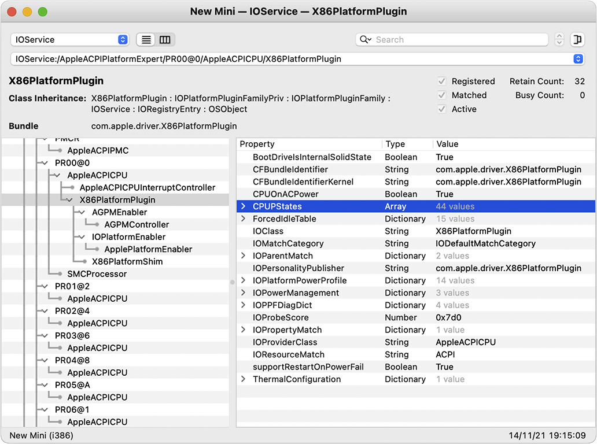
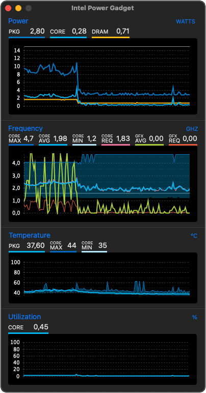
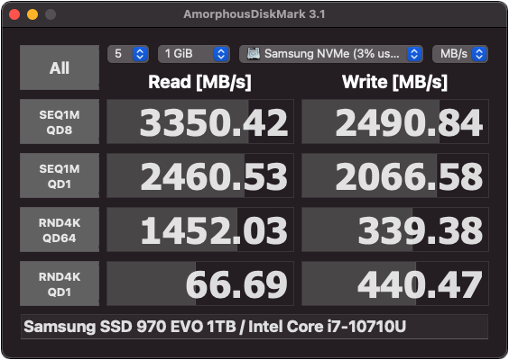

# Intel NUC Model NUC10i7FNH

This repository contains personal work and files, developed and maintained for a successful use with [OpenCore EFI bootloader](https://github.com/acidanthera/OpenCorePkg) on this specific Intel NUC model. There are **no** ready, pre-packaged EFI solutions provided; instead, the needed configuration and ACPI files are published for those interested in studying the code, while creating their own bootloader configurations.

**Table Of Contents**
- [Platform Generation](#platform-generation)
- [Product Generation](#product-generation-frost-canyon-2019)
- [Processor Generation](#processor-generation-comet-lake-2019)
- [Geekbench](#geekbench)
- [Product Overview](#product-overview)
- [Compatible Models](#compatible-models)
- [Current Setup](#current-setup)
- [Required BIOS Settings](#required-bios-settings)
- [OpenCore Keyboard Shortcuts](#opencore-picker-keyboard-shortcuts)
- [Active Configuration](#active-configuration)
- [Unsupported CFG Lock](#unsupported-cfg-lock-in-bios-warning)
- [Intel UHD Graphics Properties](#intel-uhd-graphics-630-properties)
- [USB Port Mapping](#usb-port-mapping-on-nuc-chassis)
- [CPU Fan Reading](#cpu-fan-reading-support)
- [Wireless Connectivity](#wireless-connectivity)
- [CPU Power Management](#cpu-power-management)
- [Changes By macOS 13](#changes-brought-about-by-macos-13)
- [Changes By macOS 12](#changes-brought-about-by-macos-12)
- [Changes By macOS 11](#changes-brought-about-by-macos-11)

## Platform Generation

* Sandy Bridge = All Core ix-3xxx (HD Graphics 3000)
* Ivy Bridge = All Core ix-3xxx (HD Graphics 4000)
* Haswell = All Core ix-4xxx (HD Graphics 4600)
* Broadwell = All Core ix-5xxx (Iris Pro Graphics 6200)
* Skylake = All Core ix-6xxx (HD Graphics 5xx)
* Kaby Lake = All Core ix-7xxx (UHD/Iris Plus Graphics 6xx)
* Coffee Lake = All Core ix-8xxx (UHD/Iris Plus Graphics 6xx)
* Whiskey Lake = Low-power Coffee Lake processors (mainly Mobile)
* Coffee Lake Refresh = All Core ix-9xxx (UHD Graphics 6xx)
* **Comet Lake = All Core ix-10xxx (UHD Graphics 6xx)**

## Product Generation: Frost Canyon (2019)

**Specifications:** N/A (original [Intel website](https://www.intel.com/content/www/us/en/ark/products/188811/intel-nuc-10-performance-kit-nuc10i7fnh.html) no longer exists)

**Downloads:** see [ASUS website](https://www.asus.com/supportonly/NUC10I7FNH/HelpDesk_Download/) as original [Intel website](https://www.intel.com/content/www/us/en/products/sku/188811/intel-nuc-10-performance-kit-nuc10i7fnh/downloads.html) no longer exists

**BIOS Update & Recovery Instructions:** N/A (original [Intel website](https://www.intel.com/content/www/us/en/support/articles/000033291/mini-pcs.html) no longer exists)

**BIOS Troubleshooting:** see [Intel website](https://www.intel.com/content/www/us/en/support/articles/000005964/mini-pcs.html)

## Processor Generation: Comet Lake (2019)

**CPU:** Intel Core i7-10710U @ 1.10 GHz up to 4.70 GHz / 6 Cores / 12 Threads

**GPU:** Intel UHD 630 Graphics / 300 MHz up to 1.15 GHz

**Specifications:** see [Intel website](https://www.intel.com/content/www/us/en/products/sku/196448/intel-core-i710710u-processor-12m-cache-up-to-4-70-ghz/specifications.html)

## Geekbench

**V4 Scores:** https://browser.geekbench.com/v4/cpu/search?q=Core+i7-10710U

**V5 Scores:** https://browser.geekbench.com/v5/cpu/search?q=Core+i7-10710U

**V6 Scores:** https://browser.geekbench.com/v6/cpu/search?q=Core+i7-10710U

## Product Overview

## Compatible Models

Mac Model: **Macmini8,1** 
CPU: i7-8700B @ 3.20 GHz up to 4.60 GHz / 6 Cores / 12 Threads 
GPU: Intel UHD Graphics 630 
Everymac: https://everymac.com/ultimate-mac-lookup/?search_keywords=Macmini8,1 
Board ID: 7BA5B2DFE22DDD8C 
BIOS Revision: MM81.88Z.F000.B00.1809171422 
BIOS Revision: MM81.88Z.F000.B00.1907261958 
BIOS Revision: MM81.88Z.F000.B00.2001052107 
BIOS Revision: MM81.88Z.F000.B00.2005132145 
BIOS Revision: MM81.88Z.F000.B00.2101062036 
BIOS Revision: MM81.88Z.F000.B00.2105212325 
BIOS Revision: MM81.88Z.F000.B00.2110032010 
BIOS Revision: MM81.88Z.F000.B00.2111162120 

## Current Setup

**Memory:** 32GB in 2 x 16GB SO-DIMM (1.2V) 
**RAM:** Kingston Fury "Impact" DDR4 @ 2666MHz CL15 (Model KF426S15IB1K2/32) 
**WLAN:** Intel Dual-Band Wi-Fi 6 AX201 (Embedded Module) [[8086:02f0]](http://pci-ids.ucw.cz/read/PC/8086/02f0) (Subsystem ID 0x0074) 
**BTLE:** Intel Bluetooth 5.1 (Embedded Module) [8087:0026] 
**NVMe:** PNY XLR8 NVMe M.2 500GB (Model CS3030) [[1987:5012]](https://pci-ids.ucw.cz/read/PC/1987/5012) 
**Previous NVMe:** Samsung EVO 970 NVMe M.2 1TB (Model MZ-V7E1T0BW) [[144d:a808]](https://pci-ids.ucw.cz/read/PC/144d/a808) 
**SSD:** SanDisk Ultra 3D SSD 2TB (Model SDSSDH3-2T00-G25) 
**Thunderbolt:** Intel JHL7540 Thunderbolt 3 Bridge (Titan Ridge 2C 2018) [[8086:15e7]](https://pci-ids.ucw.cz/read/PC/8086/15e7) 
**Intel Product Compatibility Tool:** see [Intel website](https://compatibleproducts.intel.com/ProductDetails?EPMID=188811) 

**N.B.** The original RAM installed were 2 x 8GB Kingston HyperX "Impact" modules (Model HX426S15IB2K2/16)
**N.B.** The PNY CS3030 system drive has a Phison E12 controller with LPDDR4 DRAM and Toshiba TLC memory.

## Required BIOS Settings

For the essential but _required_ BIOS settings, as well as previous firmware releases, see [BIOS](BIOS/) folder.

## OpenCore Picker Keyboard Shortcuts

When the `Timeout` key is set and OpenCore Picker displays the available boot drives:

* Press **Space Bar** to access the hidden _Auxiliary_ tools e.g. UEFI Shell, NVRAM Cleanup, Verify MSR Lock.
* Press **Tab** to move selection to the newly available Reboot and Shutdown icons (since OpenCore 0.6.8).

Alternatively, if `ShowPicker` is disabled or `Timeout` set to 0, keep pressing **Escape** or **Zero** or **Option** keys to access Picker just before OpenCore kicks-in and starts booting.

## Active Configuration

* Faking CPU ID is **absolutely** required, power management is native; MSR `0xE2` **cannot** be unlocked; :warning:
* External USB 3.1 ports work as expected; using generated `USBPorts.kext`;
* Internal USB 2.0 headers not used; they are disabled in BIOS;
* External USB-C ports **not** tested yet;
* Intel graphics acceleration works as platform ID `0x3E9B0007` with [WhateverGreen](https://github.com/acidanthera/whatevergreen/releases);
* Analogue audio output works as layout ID `0x17` with [AppleALC](https://github.com/acidanthera/AppleALC/releases/);
* Digital audio output does **not** work yet;
* Embedded Intel LAN interface works with [IntelMausi](https://github.com/acidanthera/IntelMausi/releases);
* Embedded Intel WLAN module works with [OpenIntelWireless](https://github.com/OpenIntelWireless/itlwm/releases);
* Embedded Intel BTLE module detected with [IntelBluetoothFirmware](https://github.com/OpenIntelWireless/IntelBluetoothFirmware/releases);
* CPU fan readings work with `ec-device` as `Intel_EC_V9` with [VirtualSMC](https://github.com/acidanthera/VirtualSMC/releases);
* Integrated Genesys Logic **GL9755** SD card reader [[17a0:9755]](http://pci-ids.ucw.cz/read/PC/17a0/9755) now _seems_ compatible out-of-the-box;
* Power Management is present and active as `X86PlatformPlugin` is attached to `PR00` in IORegistry;
* Sleep/Wake both work without issues; see "Power" section in [Hackintool](https://github.com/headkaze/Hackintool/releases);
* Both NVMe and SSD SATA interfaces work with no effort nor kext needed.

For the complete list of all detected PCI hardware components and their respective addresses via `lspci -nn` command (in Ubuntu, loaded via USB) see [here](Various/lspci-nn.txt). This list was created with all devices enabled in BIOS and is used as a device "map" so that PCI IDs can be detected before tweaking the hardware (and BIOS) to run macOS.

## Unsupported CFG Lock in BIOS :warning:

Intel has **never** provided an option in its BIOS releases to allow setting the CPU value regarding CFG Lock i.e. the MSR `0xE2` register to be unlocked; the only method that originally worked, was to use special EFI tools such as `ControlMsrE2.efi` and `CFGLock.efi` via the UEFI Shell in OpenCore, with **only** the latter being successful.

However, since BIOS revision FN0056, it seems that Intel has **locked** NVRAM access to the respective MSR `0xE2` region; as a result, the tool `CFGLock.efi` **can no longer change the CFG Lock setting.**

To continue using macOS without issues, this new restriction now requires a specific "quirk" in OpenCore _Kernel_ configuration to be set for the current hardware platform, so that kernel panics are avoided at all times: `AppleXcpmCfgLock` must be set to `true`.

As a reminder, according to the OpenCore Configuration manual and a [further clarification](https://github.com/acidanthera/bugtracker/issues/1751#issuecomment-900576662) in a support thread:

* `AppleCpuPmCfgLock` relates only to `AppleIntelCPUPowerManagement.kext` which is no longer used on El Capitan 10.11 or newer systems, for Haswell or newer platforms;
* `AppleXcpmCfgLock` requires Haswell or newer platforms and affects any supported macOS (but is _not_ used on any macOS using IvyBridge or older).

## Intel UHD Graphics 630 Properties

The `AAPL,ig-platform-id` property set to `0x3E9B0007` is used for **WhateverGreen** to successfully enable acceleration on this graphics device [[8086:9bca]](http://pci-ids.ucw.cz/read/PC/8086/9bca). This ID represents the following properties and connectors:

| Properties             | Value(s)                             |
| ---------------------- | ------------------------------------ |
| Platform ID            | 0x3E9B0007 → `07009B3E` → `BwCbPg==` |
| Device ID              | 0x3E9B0000 → `9B3E0000` → `mz4AAA==` |
| Mobile                 | No                                   |
| Stolen Memory          | 57 MB                                |
| Framebuffer Memory     | 0 MB                                 |
| Video Memory (VRAM)    | 1536 MB                              |
| Total Stolen Memory    | 58 MB                                |
| Total Cursor Memory    | 1 MB                                 |
| Maximum Stolen Memory  | 172 MB                               |
| Maximum Overall Memory | 173 MB                               |
| Model Name             | Intel UHD Graphics 630               |
| Camellia               | CamelliaDisabled (0)                 |
| Connector Count        | 3                                    |
| Default Pipe / Port #1 | Bus ID `0x05` Pipe `9`  Connector DP |
| Default Pipe / Port #2 | Bus ID `0x04` Pipe `10` Connector DP |
| Default Pipe / Port #3 | Bus ID `0x06` Pipe `8`  Connector DP |
| Patching Required      | No                                   |

Read more at [Intel® HD Graphics FAQs](https://github.com/acidanthera/WhateverGreen/blob/master/Manual/FAQ.IntelHD.en.md) on the **WhateverGreen** repository.

## USB Port Mapping on NUC Chassis

| USB 2.0 Port Name | USB 3.0 Port Name | Hardware Location    | Controller     |
| ----------------- | ----------------- | -------------------- | -------------- |
| HS01              | SS01              | Rear TOP socket      | Primary XHCI   |
| HS02              | SS02              | Rear BOTTOM socket   | Primary XHCI   |
| HS03              | SS03              | Front RIGHT socket   | Primary XHCI   |
| HS04              | SS04              | Front USB-C socket   | Primary XHCI   |
| HS07              | N/A               | Internal USB-C alias | Primary XHCI   |
| HS10              | N/A               | Internal BTLE port   | Primary XHCI   |
| N/A               | SS01              | Rear USB-C socket    | Secondary XHCI |

The above active and working USB ports are listed in Hackintool when the two *internal* (USB 2.0) headers and **Consumer IR** are all _disabled_ in [BIOS](BIOS/) and when **all unused or non-referenced USB ports** are removed. In any other situation, ports such as HS05, HS06, HS07, HS08, HS09, USR1, USR2, SS05 and SS06 may be listed. All ports above are defined in `USBPorts.kext` according to their _electrical_ connector.

**N.B.** Following some testing with external devices, it is believed that HS07 serves as the USB 2.0 alias for the rear USB-C (Thunderbolt XHCI) socket.

## CPU Fan Reading Support

Support for the NUC's embedded chipset **ITE IT5571** has been added in [VirtualSMC](https://github.com/acidanthera/VirtualSMC/releases) (and more specifically `SMCSuperIO.kext`) since version 1.2.2 thanks to its developers. This is achieved by injecting the needed property `<key>ec-device</key>` and the correct identifier that corresponds to the NUC's model/generation own **LPC Controller** device (see [here](https://github.com/acidanthera/VirtualSMC/blob/master/Docs/EmbeddedControllers.md)). For this NUC, the value is `<string>Intel_EC_V9</string>` thus enabling CPU fan readings in any monitoring tool.

## Wireless Connectivity

The embedded 802.11ax wireless [AX201](https://ark.intel.com/content/www/us/en/ark/products/130293/intel-wi-fi-6-ax201-gig.html) chipset [[8086:02f0]](http://pci-ids.ucw.cz/read/PC/8086/02f0) has been working without issues with [itlwm](https://github.com/OpenIntelWireless/itlwm) since Catalina. As for the embedded BTLE module, Intel reports it being a Bluetooth 5.1 device, which works in most cases with [IntelBluetoothFirmware](https://github.com/OpenIntelWireless/IntelBluetoothFirmware) since Catalina, too. Both devices can be enabled in BIOS, and both drivers can be loaded through OpenCore.

## CPU Power Management

With the injection of `SSDT-PLUG.aml` via OpenCore, we can verify that Power Management is present and active as `X86PlatformPlugin` is attached to the first CPU core `PR00` per the [Dortania Guide](https://dortania.github.io/OpenCore-Post-Install/universal/pm.html).

## Changes Brought About by macOS 13 and later

MacOS 13.x _Ventura_ and later [drops support for pre-Haswell CPUs](https://dortania.github.io/OpenCore-Install-Guide/extras/ventura.html#table-of-contents). Moreover, much of userspace now requires AVX2 support; because of this, macOS "Delta" updates (i.e. small 1-3 GB updates that normally appear in System Settings) will **no longer be available** and the full update (±12GB) must be installed each time, as Delta updates only contain the non-AVX2 cache to support Rosetta on Apple Silicon machines. OpenCore patching mechanism relies on these AVX2 instructions.

## Changes Brought About by macOS 12

MacOS 12.x _Monterey_ has brought an important change in OpenCore configuration for BTLE, namely the required removal of **IntelBluetoothInjector.kext** and its replacement by **BlueToolFixup.kext** found inside [BrcmPatchRAM](https://github.com/acidanthera/BrcmPatchRAM) package. The main **IntelBluetoothFirmware.kext** remains active and must still be loaded, as done previously.

:warning: From version 2.2.0 of [IntelBluetoothFirmware](https://github.com/OpenIntelWireless/IntelBluetoothFirmware/releases) onwards, there is a new kext **IntelBTPatcher.kext** included that the developers recommend loading as it fixes a bug in Apple's _Monterey_ re-written Bluetooth stack. For more details read [here](https://openintelwireless.github.io/IntelBluetoothFirmware/FAQ.html#what-is-intelbtpatcher-trying-to-fix).

There is also a distinct version of [AirportItlwm.kext](https://github.com/OpenIntelWireless/itlwm/releases) compiled for _Monterey_ only that has to be installed, replacing the Big Sur version of the kext _without_ any OpenCore configuration changes, however.

## Changes Brought About by macOS 11

An analysis of all the novelties that _Big Sur_ brings are detailed over at [Dortania](https://dortania.github.io/hackintosh/updates/2020/11/12/bigsur-new.html).

